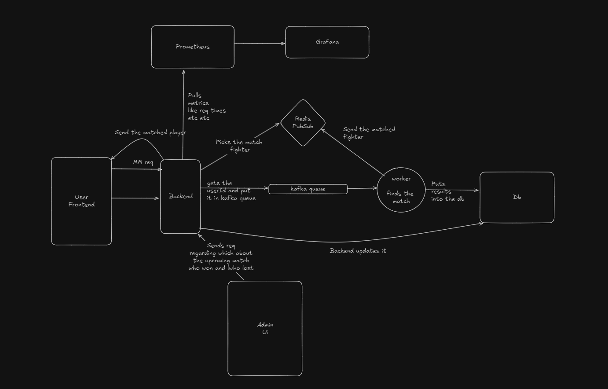

# Fightlinx

This is a MMA website on which fighters can register and look for a match. The matchmaking algorithm runs a KNN algorithm for matchmaking.

Deployed version - https://fightlinx.vercel.app

## Tech Stack

#### Frontend
- Next.js
- React.js
- Storybook
- ShadCN
- MUI
- Typescript

#### Backend
- Node.js
- Express.js
- Tensorflow.js
- Kafka
- Redis Pub/Sub
- Prisma ORM (for postgreSQL db)

#### DevOps
- Docker
- Github CI/CD
- AWS

## What's inside?

This Turborepo includes the following packages/apps:

### Apps and Packages

- `frontend`: a [Next.js](https://nextjs.org/) app for the fighters to register and look for opponents.
- `admin`: another [Next.js](https://nextjs.org/) app for the admin to manage the fights (not completed it).
- `storybook`: [React.js](https://react.dev/) app with storybbok initialised, it can be used as a react app but more specifically wanted it to test components independently using storybook.
- `backend`: [Express.js](https://expressjs.com/) app and [esbuild](https://esbuild.github.io/) as the bundler.
- `mm`: Runs the machine learning algorith (KNN) for find a perfect match of the fighter.
- `@repo/db`: Initialised with [prisma](https://www.prisma.io/) and it exposes the prisma client.
- `@repo/kafka`: Intialised with [kafkajs](https://kafka.js.org/) and it exposes the kafka client singleton.
- `@repo/ui`: a stub React component library shared by both `frontend` and `admin` applications which includes [shadcn](https://ui.shadcn.com/) and [MUI - material ui](https://mui.com/material-ui/getting-started/) and [tsup](https://tsup.egoist.dev/) as the bundler.
- `@repo/eslint-config`: `eslint` configurations (includes `eslint-config-next` and `eslint-config-prettier`).
- `@repo/typescript-config`: `tsconfig.json`s used throughout the monorepo.
- `@repo/tailwind-config`: `tailwind.config.js`s used throughout the monorepo.
- `@repo/zodTypes`: exports the zodTypes.
- `@repo/topics`: exports the topics/channel for kafka and redis.
- `docker`: contains the dockerfile for the apps, which will be build in the ci/cd pipeline and then be deployed to my dockerhub and ec2 instance.

### Workflow

This is how the workflow is designed



When the user signs-up and register for a fight the request is sent to the backend and then the backend validates the user and its figter profile. Once, validated it sends the matchmaking request in the kafka queue and subscribes on the `matchmaking` channel on the redi pub/sub which is taken out by a matchmaking processor running independently. The matchmaking algorithm uses tensorflow.js and runs a KNN algorithm to find the perfect match for the user which wanted a fight. And once the match is found the matchmaking processor puts it into the database and sends a `SUCESS` message to the backend on the `matchmaking` channel. Once the backend receives this messege it returns a 200 status code the frontend.

I've chosen this architecture so that I'm not processing and running a big algorithm on the primaru backend also by following this architecture it can be easily scaled up horizontally by running multiple instances of the worker(matchmaker) easily. Which would be cost efficient rather than scaling up the whole primary backend.

### Running the project locally

Follow this [video](https://drive.google.com/file/d/1XDMOdq0sURbioo83CQBIiLfxFdpVI_82/view?usp=drive_link) to understand more better


To clone the repo run

```shell
git clone https://github.com/Ayush272002/Fightlinx.git
cd Fightlinx
npm i
npm run build
```
After that go to `apps/frontend` and create a .env file over there and paste this inside that
`NEXT_PUBLIC_API_BASE_URL=http://localhost:8000`

Now run the frontend

go to the frontend directory of the project and run
```shell
cd app/frontend
npm run dev
```

Now for running the backend and the mm, paste the given `docker-compose.yml` in the root dir of project and run

```shell
docker-compose up
```

## Contributing

Contributions are welcome! If you have suggestions for new features, bug fixes, or improvements, please fork the repository and submit a pull request. For major changes, please open an issue first to discuss what you would like to change.

## License

This project is licensed under the MIT License - see the [LICENSE](LICENSE) file for details.

## Contact

If you have any questions or suggestions, please feel free to contact.